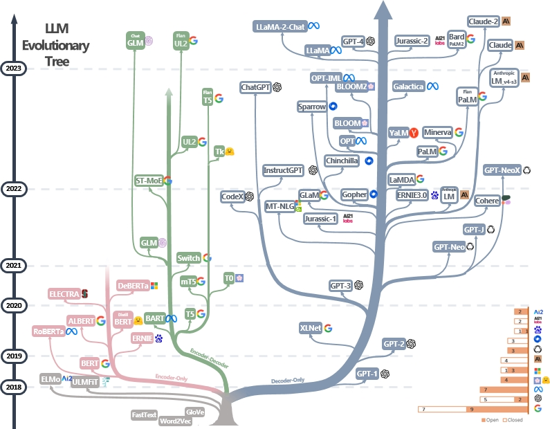

# gpt2-small-js

JavaScript implementation of Generative Pre-trained Transformer 2 ([GPT-2](https://en.wikipedia.org/wiki/GPT-2)) small (124 million parameters) based on Ishan Anand's [spreadsheets are all you need.ai](https://spreadsheets-are-all-you-need.ai/gpt2/) implementation for educational purposes.

## Why study GPT-2?

GPT-2 (2019) is the predecessor of state-of-the-art large language models (LLMs) such as ChatGPT (2022), Claude, Llama, and Bard.

The following diagram shows this relationship:

GPT-2 is based on the transformer architecture introduced by [Attention Is All You Need](https://en.wikipedia.org/wiki/Attention_Is_All_You_Need) in 2017, and shares similar architecture to the wildly successful ChatGPT model.

The main differences between GPT-2 and ChatGPT are scale (in terms of both parameter count and training dataset), and how they were trained.

Anand claims understanding GPT-2 allows understanding 80% of state-of-the-art models.

## Simplified Architecture

GPT-2 takes in text as input and outputs the most-likely next token using the following simplified architecture:

1. [Tokenization](#tokenization)
2. [Text & Position Embeddings](#token--position-embeddings)
3. (loop 12 times)
    1. Multi-head Attention
    2. Multilayer Perceptron
4. Language Head

Understanding next token predicion enables understanding most of the process since longer text sequences can be generated by appending the output to the input and re-running the model.

The first two steps, tokenization and embeddings, are to map text to numbers for the computer to process them.

## Tokenization

Tokenization is the process of splitting text into smaller units called *tokens*.

Different tokenization algorithms output tokens with different scales such as words, subwords and characters.

The algorithm GPT-2 uses for tokenization is [byte-pair encoding (BPE)](#byte-pair-encoding-bpe) which outputs sub-word tokens.

Each token represents an item in the model's vocabulary, and receives a token **id**entifier which is the position in the dictionary.

## Why subword tokens?

Word-based tokenization increases the size of the model's vocabulary.

This leads to an increase in the number of model parameters, and hence space and time complexity.

For example, English has ~170,000 words where GPT-2 has ~50,000 tokens in its vocabulary.

Character-based tokenization also increases the space and time complexity since there are matrices with rows for each token.

There's also low semantic correlation between characters.

For example, you can read the following passage even though the characters are jumbled:

> Aoccdrnig to a rscheearch at Cmabrigde Uinervtisy, it deosn't mttaer in waht oredr the ltteers in a wrod are, the olny iprmoetnt tihng is taht the frist and lsat ltteer be at the rghit pclae.
The rset can be a toatl mses and you can sitll raed it wouthit porbelm.
Tihs is bcuseae the huamn mnid deos not raed ervey lteter by istlef, but the wrod as a wlohe.

Subword tokenization lies somewhere in between word-based and character-based tokenization.

### Byte-pair Encoding (BPE)

[Byte-pair encoding (BPE)](https://en.wikipedia.org/wiki/Byte-pair_encoding) is a compression algorithm introduced by Philip Gage in "A New Algorithm for Data Compression (1994)".

## Text & Position Embeddings

Every token receives an embedding.

An embedding is a list of numbers that represent both the meaning and position of the token in the prompt.

In GPT-2, the embedding size is 768.

The embedding values are learned during training.

## References

* [How LLMs work for Web Devs: GPT in 600 lines of Vanilla JS - Ishan Anand](https://www.youtube.com/watch?v=ZuiJjkbX0Og)
* [Neural Machine Translation of Rare Words with Subword Units](https://arxiv.org/abs/1508.07909) - introduced using byte-pair encoding in machine learning.
